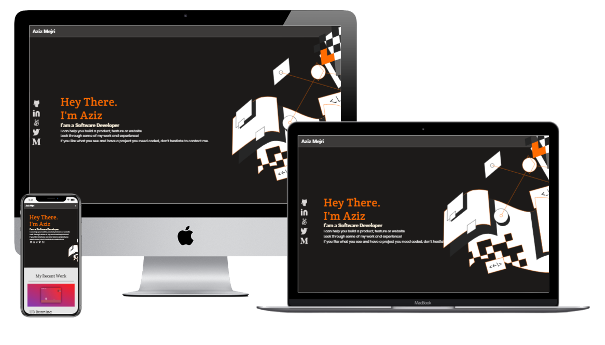

# Mobile menu

> This is a project for microverse 2.0 training

Additional description about the project and its features.

## Built With

- HTML
- CSS

## Live Demo

[Live Demo Link](https://rawcdn.githack.com/peterrobert/Portfolio-mobile-menu/ccae4d7928f06d60e7a90c7f1422abd9d1fdf1de/index.html)

To get a local copy up and running follow these simple example steps.

## Authors

👤 **Peter Robert**

- Github: [@peterrobert](https://github.com/peterrobert)
- Linkedin: [Peter Robert Ndungu](https://www.linkedin.com/in/peter-rob-ndungu/)

## 🤝 Contributing

Contributions, issues, and feature requests are welcome!

Feel free to check the [issues page](../../issues/).

## Show your support

Give a ⭐️ if you like this project!

## Acknowledgments

- Hat tip to anyone whose code was used
- Inspiration
- etc

## 📝 License

This project is [MIT](./MIT.md) licensed.